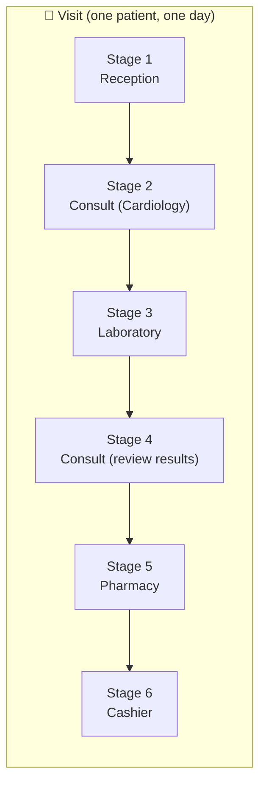
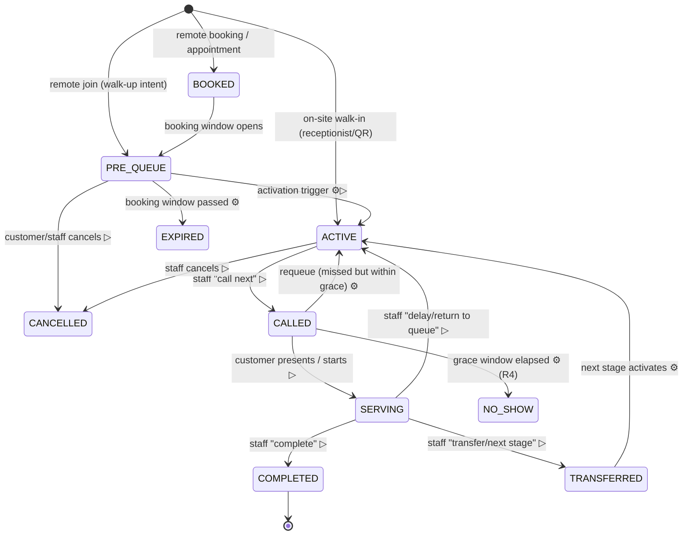
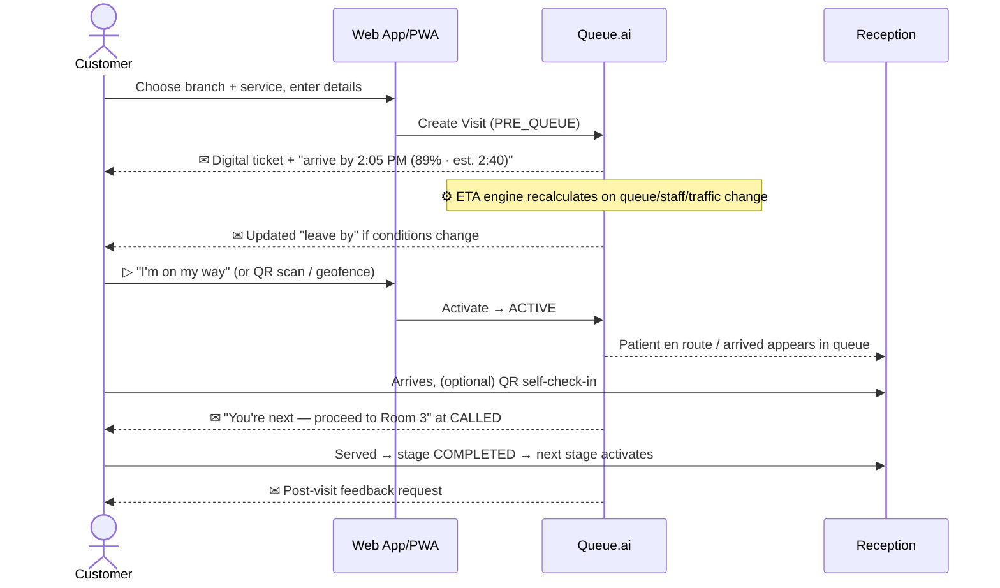
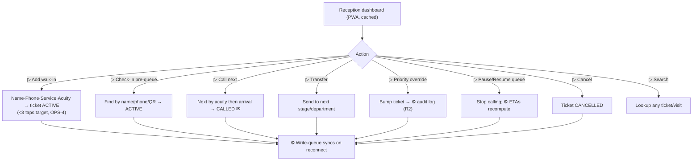
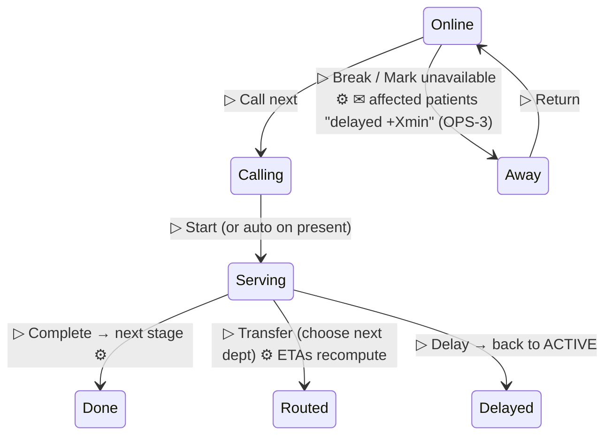
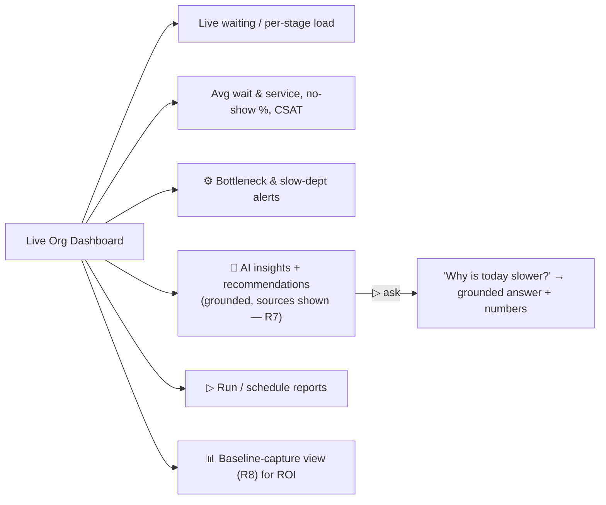
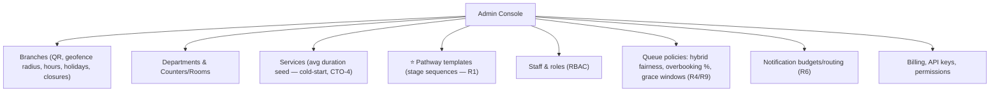
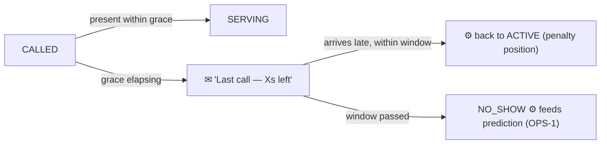

# Queue.ai — User Flows & State Machines

**Version:** 1.0 (for approval)
**Phase:** 2
**Depends on:** [01-PRD.md](01-PRD.md) v1.1, [01b-RED-TEAM.md](01b-RED-TEAM.md) (R1–R10)
**Scope note:** Full vision is described; **[MVP]** tags mark what's in the hospital MVP. WhatsApp & native mobile flows are documented but tagged fast-follow.

> Diagrams use Mermaid. Conventions: rounded = state, `▷` = actor action, `⚙` = system/automatic action, `✉` = notification emitted.

---

## 0. Cast of Actors

| Actor | Primary surface | Core verbs |
|-------|-----------------|-----------|
| **Customer (Patient)** | Web app / QR / WhatsApp / SMS | join, activate, check-in, track, leave feedback |
| **Receptionist** | Reception dashboard (offline-capable) | register, check-in, call, transfer, priority, cancel |
| **Staff (Doctor/Nurse/Tech/Pharmacist/Cashier)** | Staff dashboard (1-tap) | call next, complete, transfer, delay, break |
| **Manager** | Org dashboard | monitor, act on AI insights, run reports |
| **Admin** | Admin console | configure branches/depts/services/pathways/staff |
| **Super Admin** | Internal | provision tenants, monitor platform |

---

## 1. The Big Idea — Tickets ride a *Pathway*, not a single queue (R1)

A hospital visit is a **pipeline**. In Queue.ai a **Visit** owns an ordered list of **Stages**; each Stage is a ticket in *one department's queue*. The patient flows stage→stage; ETA is the **sum of remaining stages**.

- A **Pathway template** (configured by Admin per service, Phase 4/9) defines the default stage sequence; the doctor can branch it at runtime (e.g. add Lab, skip Pharmacy).
- Each Stage is independently queued, predicted, and notified. Only the **current** stage occupies an active queue slot; downstream stages are *pending*.
- **Total ETA** shown to the patient = remaining wait of current stage + Σ predicted durations of pending stages, with a widening confidence band per stage out.

---

## 2. Canonical Ticket/Stage State Machine

Applies to **each stage** of a visit. (A Visit is "complete" when its last stage is `COMPLETED`.)

**Activation triggers (PRE_QUEUE → ACTIVE)** — any one (R-CTO1: GPS is never sole):
1. ▷ Customer taps **"I'm on my way"**
2. ▷ Customer **scans branch QR**
3. ▷ **Receptionist** manual check-in
4. ⚙ **GPS** inside geofence *(enhancement only; requires foregrounded app + permission)*

**Priority/acuity (R2)** is an attribute on the ticket, not a state — it reorders the ACTIVE queue; emergencies can preempt. Every override writes an **audit record**.

---

## 3. Customer Flows

### 3.1 Join — Method matrix

| Method | MVP? | Entry → outcome |
|--------|------|-----------------|
| Receptionist walk-in | ✅ | Staff registers → ticket starts **ACTIVE** at Reception stage |
| QR code | ✅ | Scan branch QR → pick service → details → ticket (ACTIVE if on-site) |
| Web app (remote) | ✅ | Book/join remotely → **PRE_QUEUE** → activate later |
| WhatsApp | ⏳ fast-follow | Chatbot → service → details → ticket + live updates |
| Native mobile | ⏳ fast-follow | Same as web, native |
| SMS (low-tech) | ✅ (inbound status, outbound alerts) | Receives ticket #, ETA, "you're next" via SMS |

### 3.2 Remote join → arrival (the headline flow)

### 3.3 Customer states they experience
`Booked → On the way → Checked in → Waiting (live position + ETA) → Called (where to go) → Being served → Next stage / Done → Feedback`. Always a **confidence band**, never a promise (R4). If late but within grace → re-activation prompt instead of silent no-show.

---

## 4. Receptionist Flow (offline-capable — R5)

**Offline behavior:** actions write to a local queue and reconcile on reconnect; if a conflict arises (e.g. two desks called the same number), last-writer + audit flag surfaces it. **Paper fallback** procedure documented for full outage.

---

## 5. Staff Flow (minimal interaction — ADM-4)

Designed so a busy doctor touches as little as possible. Default operator of state can be the nurse/receptionist; staff view is "what's next."

Every staff action that changes load (`complete`, `transfer`, `delay`, `away`) **triggers ETA recompute** for the affected stage queue and emits notifications only where the change crosses a threshold (cost-aware, R6).

---

## 6. Manager Flow

The AI assistant is **read-only**; every figure links to the query/metric behind it.

---

## 7. Admin Flow (configuration)

---

## 8. Cross-Cutting / System Flows

### 8.1 ETA recompute (event-driven)
Triggered by: new arrival, completion, transfer, cancellation, no-show, staff away/return, priority override, traffic change (for "leave by"). → recompute affected stage(s) → update visible position + confidence → **notify only on threshold-crossing** events ("you're next", "+12 min delay"), not every tick (R6).

### 8.2 No-show & grace (R4)

### 8.3 Emergency / priority preemption (R2)
Emergency ticket inserted at front of ACTIVE queue (or its own Emergency queue); ⚙ recompute; ✉ affected patients informed of delay; ⚙ audit log who/why.

### 8.4 Low-tech / SMS path (R5)
No smartphone → receptionist/QR creates ticket → patient receives **SMS** ticket #, position summary, and "you're next." Inbound SMS keyword can request status. Push-first cost rule still applies (R6).

### 8.5 Baseline-capture mode (R8)
For the first 1–2 weeks a branch can run in measure-only mode (record actual waits with minimal intervention) to establish the "before" number for ROI.

---

## 9. Exception & Edge Cases (inventory for Phase 4/5)

| # | Case | Intended handling |
|---|------|-------------------|
| E1 | Two desks call same ticket (offline) | Last-writer wins + audit flag surfaced |
| E2 | Patient activates from home but never arrives | Grace → NO_SHOW; slot freed |
| E3 | Doctor goes on break mid-queue | ✉ delay to affected; manager alerted (OPS-3) |
| E4 | Pathway branches at runtime (add Lab) | Insert pending stage; ETA recomputes |
| E5 | Patient skips a stage (e.g. no pharmacy) | Staff marks stage skipped; visit continues |
| E6 | Full power/internet outage | Offline cache + paper fallback; reconcile later |
| E7 | Duplicate booking / fake booking | Pre-Queue + activation requirement blocks slot hoarding |
| E8 | Walk-in vs appointment contention | Hybrid policy (reserved %/interleave) per branch (R9) |
| E9 | ETA wildly wrong (cold start) | Wide band + "still learning" label (CTO-4) |
| E10 | Customer cancels mid-pathway | Visit cancelled; downstream stages voided |

---

## 10. What Phase 3 (Wireframes) must cover
Every screen implied above: Customer (ticket, live ETA, pathway progress, feedback), Reception (add/queue/search, offline state), Staff (1-tap next/done/transfer), Manager (live + AI + baseline), Admin (pathway builder is the novel one). Public **display screen** with privacy-safe ticket numbers (R3).

---

## Approval
> ✅ **Approve Phase 2** to proceed to **Phase 3 — Wireframes & Information Architecture**.
> Or request changes (e.g. adjust the pathway model, add an actor flow) and I'll revise.
