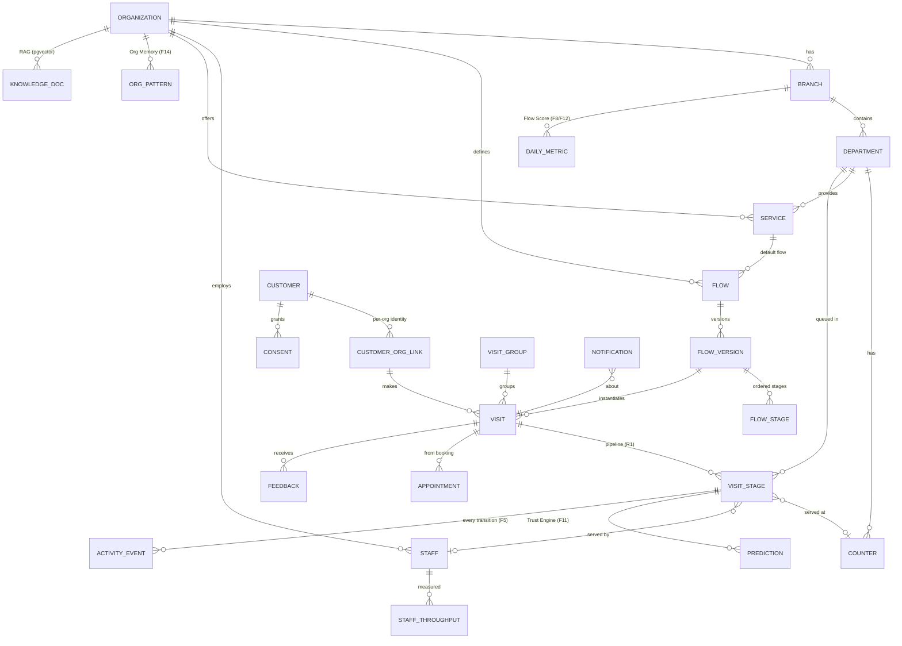

# Queue.ai — Database Design

**Version:** 1.0 (for approval)
**Phase:** 4
**Engine:** PostgreSQL 16 + **PostGIS** (geo) + **pgvector** (RAG) + **TimescaleDB** (event/metric time-series). Per [01c-TECH-STACK.md](01c-TECH-STACK.md).
**Traceability:** every table maps back to flows ([02](02-USER-FLOWS.md)), features ([01d](01d-FEATURE-REGISTER.md): F1–F14), refinements ([01b](01b-RED-TEAM.md): R1–R10). Mapping matrix in §11.

> Design intent (Law #0 + feature register): the schema makes **flows data-not-code (F1)**, captures **time + throughput + every state change** from day one so Capacity AI/Simulation/Time-Saved (F2/F5/F8/F13) are *queries later*, and leaves **identity/consent/group/publish** hooks (F6/F7/F10) dormant but present.

---

## 1. Global conventions

- **PK:** `uuid` (v7, time-ordered) everywhere → no hot-spotting, globally unique for multi-org.
- **Tenancy:** every tenant-scoped table carries `organization_id` → enforced by **Row-Level Security** (§9).
- **Timestamps:** `created_at`, `updated_at` (UTC, `timestamptz`); display in `Africa/Lagos`. All durations in seconds.
- **Soft delete:** `deleted_at` (nullable) for recoverable entities; hard delete only for NDPR erasure.
- **Money:** `numeric(14,2)` + `currency` (ISO-4217, default `NGN`).
- **i18n:** `locale` columns; user-facing strings translatable (default `en`).
- **Enums:** Postgres enum types for fixed sets (states, channels, roles).
- **Audit:** sensitive mutations → `audit_log`; all operational state changes → `activity_events` (event-sourced).
- **Extensions:** `postgis`, `vector`, `timescaledb`, `pgcrypto`, `uuid-ossp`/`pg_uuidv7`.

---

## 2. High-level ERD

---

## 3. Tenancy & Configuration domain

### organizations
`id · name · slug · country(NG) · default_locale · default_currency(NGN) · timezone(Africa/Lagos) · plan_tier · billing_status · settings(jsonb) · created_at …`

### branches
`id · organization_id → · name · address · geo(geography(Point,4326)) · geofence_radius_m · qr_token(unique) · business_hours(jsonb) · holiday_rules(jsonb) · emergency_closed(bool) · publish_public_wait(bool=false) ⟵F10 · settings(jsonb) · …`
- PostGIS `geo` + `geofence_radius_m` → activation trigger (CTO-1: GPS as enhancement).
- `publish_public_wait` dormant flag enables Anonymous Public Queue (F10) later, opt-in.

### departments
`id · organization_id · branch_id → · name · type · settings(jsonb)` (e.g. Reception, Cardiology, Lab, Pharmacy, Cashier).

### counters
`id · organization_id · department_id → · name (Room 3) · status(enum: open/closed) · floor_coords(jsonb null) ⟵F3 map`

### services
`id · organization_id · department_id → · name · avg_duration_seconds (seed, CTO-4) · appointment_only(bool) · default_flow_id → · active(bool)`

### staff
`id · organization_id · user_id → (auth/Clerk) · display_name · role(enum) · department_id(null) · status(enum: online/away/break/offline) ⟵OPS-3 · skills(jsonb) · locale · …`
- `role`: super_admin · org_admin · manager · receptionist · staff (RBAC, §9).
- `status` transitions emit `activity_events` → ETA recompute + notify.

---

## 4. Flow Builder domain (F1 — the moat, flows-as-data)

### flows
`id · organization_id · name · industry_template(enum: hospital/bank/passport/custom) · current_version_id → · is_published(bool) · created_at`

### flow_versions  *(immutable snapshots — versioned like agent configs)*
`id · flow_id → · version_no(int) · created_by · created_at · notes`

### flow_stages  *(ordered, branchable)*
`id · flow_version_id → · position(int) · name · department_id → · service_id(null) → · est_duration_seconds(seed) · requires_triage(bool) · appointment_only(bool) · branch_rules(jsonb null) · is_optional(bool)`
- Ordered sequence + optional `branch_rules` (e.g. "skip Lab if no test ordered") → runtime branching (E4/E5).
- **This single design serves Hospital/Bank/Passport identically** — the difference is just rows.

---

## 5. Identity & Consent domain (F6/F9 hooks)

### customers  *(GLOBAL identity — not org-scoped; the F6 hook)*
`id · phone(e164, unique) · email(null) · full_name · preferred_locale · emergency_contact(jsonb null) · created_at`
- Deliberately **not** tenant-scoped → one profile usable across orgs later (F6). Today it's referenced only via `customer_org_link`.

### customer_org_link  *(per-org relationship + returning-patient data — F9 single-org passport)*
`id · organization_id · customer_id → · external_ref(null, HMS/EMR id ⟵R10) · first_seen · last_seen · visit_count · notes(jsonb) · consent_status`

### consents  *(NDPR — explicit, revocable)*
`id · customer_id → · organization_id(null=global) · scope(enum: service/marketing/cross_org_share) · granted(bool) · granted_at · revoked_at · source`
- `cross_org_share` consent gates F6 multi-org identity; default off.

---

## 6. Visit & Queue domain (R1 pipeline — the heart)

### visit_groups  *(F7 family/group)*
`id · organization_id · branch_id · primary_customer_id → · size · created_at`

### visits  *(one patient's journey for the day)*
`id · organization_id · branch_id → · customer_org_link_id → · group_id(null) → · flow_version_id → · status(enum: active/completed/cancelled) · acuity(enum: routine/priority/emergency) ⟵R2 · channel(enum: receptionist/qr/web/whatsapp/sms) · created_at · completed_at`

### visit_stages  *(THE "ticket" — one per pipeline stage; the active queue lives here)*
`id · organization_id · visit_id → · flow_stage_id → · department_id → · counter_id(null) · assigned_staff_id(null) ·`
`state(enum: booked/pre_queue/active/called/serving/completed/transferred/no_show/expired/cancelled) ·`
`position(int null) · acuity(enum) ·`
`entered_state_at · pre_queue_at · activated_at · called_at · serving_at · completed_at ·`
`grace_deadline(timestamptz null) ⟵R4 · activation_trigger(enum: gps/on_my_way/qr/receptionist null) ·`
`is_current(bool) · skipped(bool=false) ⟵E5 · created_at`
- The **canonical state machine** ([02 §2](02-USER-FLOWS.md)) lives in `state`; `activity_events` records every transition.
- ACTIVE queue for a department = `visit_stages WHERE department_id=? AND state='active'` ordered by `(acuity DESC, position/entered_state_at)` (R2 acuity-first).
- `grace_deadline` drives no-show/requeue sweep (R4).

### appointments  *(booking → PRE_QUEUE)*
`id · organization_id · branch_id · customer_org_link_id → · service_id → · scheduled_for · status(enum: booked/activated/expired/cancelled) · visit_id(null) · overbooking_slot(bool) ⟵R9`

### feedback
`id · organization_id · visit_id → · rating(int 1–5) · comment(null) · created_at`

---

## 7. Flow Intelligence & Trust domain (F8/F11/F12/F13/F14)

### predictions  *(Trust Engine — F11; time-series)*
`id · organization_id · visit_stage_id(null) · branch_id · department_id(null) ·`
`kind(enum: stage_eta/visit_eta/leave_by/dept_load) · value_low_s · value_high_s · confidence(numeric 0–1) ·`
`reasons(jsonb: ["queue stable","all doctors available"]) · model_version · created_at`
- Stores **range + confidence + reasons** exactly as the Trust Engine renders them. Latest cached on read; history retained for accuracy scoring. **Timescale hypertable.**

### staff_throughput  *(F2/F13 — captured from day one)*
`id · organization_id · staff_id → · department_id · window_start · window_end · served_count · avg_service_seconds · idle_seconds`
- Materialized from `activity_events`; feeds Capacity AI + Predictive Operations.

### daily_metrics  *(Flow Score F12 + AI Health Score F8 + Time-Saved Law #0)*
`id · organization_id · branch_id → · metric_date · flow_score(int 0–100) · flow_score_delta · avg_wait_seconds · no_show_rate · utilization · csat · time_saved_seconds ⟵Law#0 · best_department_id · worst_department_id · ai_summary(text) · created_at`

### org_patterns  *(Organization Memory F14 — learned local rhythms)*
`id · organization_id · branch_id(null) · pattern_type(enum: dow/weather/season/holiday) · key(jsonb e.g. {"dow":"mon"}) · factor(numeric) · confidence · learned_at`
- e.g. `{dow:mon} → arrival_factor 0.7` (doctor late), `{weather:rain} → demand_factor 0.7`.

### knowledge_docs + embeddings  *(grounded AI assistant RAG — pgvector)*
`knowledge_docs: id · organization_id · title · body · source · created_at`
`doc_chunks: id · organization_id · doc_id → · chunk · embedding(vector(1536)) · ` → IVFFlat/HNSW index for semantic retrieval (R7 grounded answers).

---

## 8. Eventing, Notifications, Audit

### activity_events  *(EVENT SOURCING — F5 simulation, twin, time-saved, replay)*
`id · organization_id · branch_id · entity_type(enum) · entity_id · event_type(enum: state_change/staff_status/override/...) · from_state · to_state · actor_type · actor_id · payload(jsonb) · occurred_at`
- **Append-only, immutable.** Timescale hypertable, partitioned by `occurred_at` (monthly). Every state transition writes one row → the source of truth for Digital Twin (F3), Simulation (F5), Capacity AI (F2), and Total Time Saved.

### notifications  *(R6 cost-aware routing)*
`id · organization_id · visit_id(null) · customer_id(null) · channel(enum: push/sms/whatsapp/email/voice) · event_type · status(enum: queued/sent/delivered/failed) · cost(numeric) · provider · provider_ref · created_at · sent_at`

### notification_budgets  *(per-org metering — R6/INV-4)*
`id · organization_id · branch_id(null) · period · sms_cap · whatsapp_cap · spent(numeric) · routing_policy(jsonb: "push-first")`

### audit_log  *(compliance — NDPR/HIPAA; priority overrides R2, PHI access)*
`id · organization_id · actor_id · action(enum: priority_override/phi_access/config_change/export/delete/login) · target_type · target_id · before(jsonb) · after(jsonb) · ip · occurred_at`
- Distinct from `activity_events` (operational): this is the **security/compliance** trail, write-once, longer retention.

### api_keys
`id · organization_id · name · key_hash · scopes(jsonb) · last_used_at · revoked_at`

---

## 9. Multi-tenancy & Row-Level Security

- **Every tenant table** has `organization_id`. A session sets `app.current_org` (and `app.current_role`); RLS policies enforce `organization_id = current_setting('app.current_org')::uuid`.
- `customers` is global; access only via `customer_org_link` (RLS-scoped) — so cross-org PII never leaks without `cross_org_share` consent.
- Defense-in-depth: app-layer tenant guard **and** DB RLS (CTO-7).
- **RBAC** via `staff.role`; row/column visibility (e.g. patient full name hidden from public-display role — R3) enforced at the query/view layer (`public_queue_view` exposes ticket number only).

---

## 10. Performance, Indexing, Scale

**Hot-path indexes:**
- `visit_stages (organization_id, department_id, state, acuity, position)` — the queue read (every few seconds).
- `visit_stages (grace_deadline) WHERE state='called'` — no-show sweep.
- `visits (organization_id, branch_id, status, created_at)`.
- `customers (phone)` unique; `customer_org_link (organization_id, customer_id)`.
- `predictions (visit_stage_id, created_at DESC)`; `activity_events (entity_id, occurred_at)`.
- PostGIS GIST on `branches.geo`; pgvector HNSW on `doc_chunks.embedding`.

**Partitioning / time-series:** `activity_events`, `predictions`, `notifications`, `daily_metrics` as **Timescale hypertables** (monthly chunks), with continuous aggregates rolling up `staff_throughput` and `daily_metrics`.

**Scale path (millions of customers / thousands of tenants):** UUIDv7 PKs avoid index hot-spots; read replicas for analytics/dashboards; Redis caches the live queue per branch (hot state) so Postgres isn't hit on every tick; archive old `activity_events` chunks to cold storage. Schema-per-tenant reserved for very large enterprise customers only.

---

## 11. Feature → Schema traceability

| Need | Tables that serve it |
|------|----------------------|
| R1 multi-stage pipeline | `visits` + `visit_stages` + `flow_*` |
| R2 acuity/triage + audited override | `visits.acuity`, `visit_stages.acuity`, `audit_log` |
| R3 display privacy | `public_queue_view` (numbers only) |
| R4 grace/no-show | `visit_stages.grace_deadline`, state machine, sweep index |
| R5 offline | client write-queue reconciles into `activity_events`/`visit_stages` (conflict flag) |
| R6 cost-aware notifications | `notifications`, `notification_budgets` |
| R7 grounded AI | `knowledge_docs`/`doc_chunks` (pgvector) + `daily_metrics.ai_summary` |
| R8 baseline mode | `daily_metrics.time_saved_seconds` vs captured baseline; `activity_events` |
| R9 overbooking/hybrid | `appointments.overbooking_slot`, branch/flow policy `settings` |
| R10 HMS/EMR | `customer_org_link.external_ref` |
| F1 Flow Builder | `flows`/`flow_versions`/`flow_stages` |
| F2 Capacity AI | `staff_throughput` + `activity_events` |
| F3 Digital Twin | live `visit_stages` aggregate + `counters.floor_coords` |
| F4 Journey Timeline | `visit_stages` (ordered, is_current) |
| F5 Simulation | `activity_events` (replayable log) |
| F6 Multi-Org Identity | global `customers` + `consents(cross_org_share)` |
| F7 Family/Group | `visit_groups` |
| F8 Health Score / F12 Flow Score | `daily_metrics` |
| F9 Queue Passport | `customer_org_link` (single-org) → +F6 (cross-org) |
| F10 Public Queue | `branches.publish_public_wait` + aggregate |
| F11 Trust Engine | `predictions` (range+confidence+reasons) |
| F13 Predictive Operations | `predictions(kind=dept_load)` + `staff_throughput` |
| F14 Org Memory | `org_patterns` |

---

## 12. NDPR / data lifecycle
- PII minimized; `customers`/`consents` are the erasure surface (right-to-be-forgotten → null PII, retain anonymized stats).
- Data residency: hosted `af-south-1`.
- Retention policy per table (e.g. raw `activity_events` 12–24 mo then aggregate-and-archive); `audit_log` retained longest.
- Encryption at rest (KMS) + in transit; secrets never in tables.

---

## 13. Open questions for Phase 5 (API)
1. Confirm `flow_stages` branching expressivity for MVP (linear + simple conditional vs full DAG).
2. Live queue: source-of-truth in Postgres with Redis cache, or Redis-authoritative with Postgres persistence? (affects API consistency model)
3. Embedding model/dimension for `doc_chunks` (set at Phase 7).
4. Per-tenant vs shared `activity_events` hypertable at scale.

---

## Approval
> ✅ **Approve Phase 4** to proceed to **Phase 5 — API Design** (REST + WebSocket events + webhooks over this schema).
> Or request schema changes (e.g. different flow-branching model, split/merge tables).
