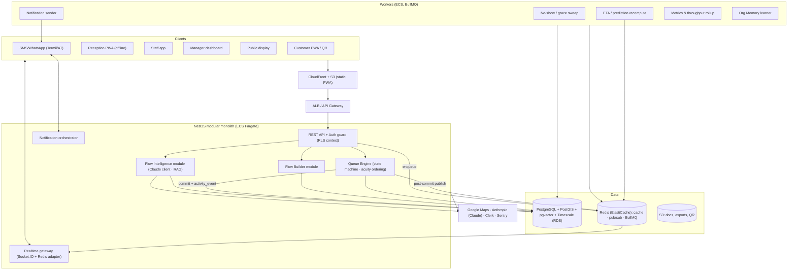
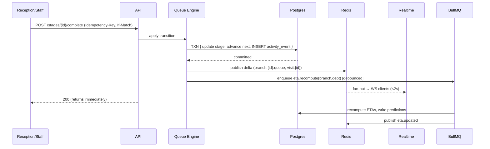
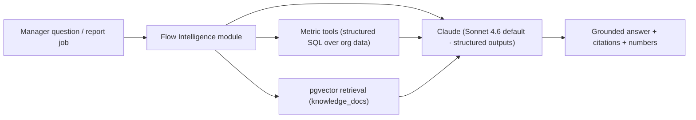

# Queue.ai — System Architecture

> ⚠️ **Partly superseded by the Supabase pivot (Phase 9).** Built as Supabase-direct (PostgREST + RPC + Realtime + a Node worker), not the NestJS/Redis/Socket.IO design below. See `ADR-001-baas-architecture.md`.

**Version:** 1.0 (for approval)
**Phase:** 6
**Over:** [04 schema](04-DATABASE.md) + [05 API](05-API.md). Stack from [01c](01c-TECH-STACK.md). Hosted **AWS af-south-1**.

> **Resolved from Phase 5:**
> 1. **Real-time = in-process Socket.IO + Redis adapter** for MVP (split to a dedicated service only if connection scale demands). 
> 2. **ETA recompute = async, debounced workers** (BullMQ) — the triggering write returns immediately; recompute fans out within ~1–2s. A fast synchronous path handles the single "you're next" call.
> 3. **`recommendations/apply` = always-confirm (rung 3) by default**; rung-4 auto-apply only for an org-whitelisted set of reversible actions, always with undo.
> 4. **Assistant = Claude per-request with prompt caching + cost/rate guards**, Sonnet 4.6 default, grounded (RAG + metric tools).

---

## 1. Architectural style — **modular monolith + workers** (not microservices yet)

For a small team racing to PMF, a **modular monolith** (NestJS, strict module boundaries) + **separate worker processes** + a **later** Python ML service is the right call: one deploy, shared types, no premature distributed-systems tax. The module seams are drawn so any module can later become a service without a rewrite (the event log is the natural integration bus).

**Why not microservices now:** INV-3 (focus), velocity, ops simplicity. **Why workers are separate from day one:** real-time API latency must never be blocked by ETA math, notifications, or AI calls.

---

## 2. Container diagram

---

## 3. Core components

| Component | Responsibility |
|-----------|----------------|
| **API (NestJS)** | REST endpoints, auth/RLS context, validation, OpenAPI. Thin — delegates to domain modules. |
| **Queue Engine** | The domain core: ticket/stage **state machine**, acuity-first ordering, transfer/pathway advance, grace logic. Every transition = Postgres txn + `activity_event` + post-commit publish. |
| **Realtime Gateway** | Socket.IO with Redis adapter; per-branch channels; auth via token claims; `seq` sequencing; polling fallback. |
| **Flow Builder** | CRUD + immutable versioning of flows; publish; preview/simulate. |
| **Flow Intelligence** | ETA/confidence/reasons (heuristic v1), Flow Score, Predictive Ops, grounded assistant (Claude + RAG). Calls workers/models; never blocks API hot path. |
| **Notification Orchestrator** | Cost-aware channel selection (push→SMS), budget enforcement, provider adapters. |
| **Workers (BullMQ)** | ETA recompute, no-show sweep, notification send, metrics/throughput rollup, Org Memory learning. |

---

## 4. The write path (the one flow that must be right)

**Invariants:** (a) the `activity_event` is written in the *same transaction* as the state change — no event can be lost; (b) the API never waits on ETA/notify/AI; (c) idempotency-key + ETag make the path retry- and offline-safe.

---

## 5. ETA / Prediction pipeline (resolves Q2)

- **Trigger:** any load-changing event enqueues `eta.recompute(branch, department)`, **debounced** (e.g. coalesce within 1–2s) so a burst of completions = one recompute.
- **Compute (v1 heuristic):** `remaining_in_stage = position × avg_service_seconds / active_servers`, summed across pending stages for visit ETA; confidence from queue stability + staff availability + historical accuracy; reasons generated from those same signals (Trust Engine F11).
- **Write:** `predictions` rows (range, confidence, reasons) + cache latest in Redis; publish `eta.updated`.
- **Fast path:** "you're next / proceed to Room 3" is emitted synchronously on the `call` transition (no wait for the batch recompute).
- **Cold start (CTO-4):** seed from `services.avg_duration_seconds`; widen bands; label low-confidence; tighten as `staff_throughput` accrues. Org Memory (F14) later adds day/weather/season factors.

---

## 6. Offline & resilience (R5 — Nigeria-grounded)

| Layer | Behavior |
|-------|----------|
| Reception PWA | Caches branch queue (IndexedDB); mutations to a local write-queue with `Idempotency-Key` + `client_ts` + ETag |
| Reconnect | `POST /sync/batch` replays ops; server applies in `client_ts` order; conflicts → flagged, not clobbered (E1) |
| Degradation | WS → polling (`?since=seq`) on poor links; skeleton states, never spinners-of-doom |
| Power/full outage | Documented **paper fallback**; reconcile on restore |
| Notifications | SMS works on 2G; push-first to save cost |
| Infra | Multi-AZ RDS + Redis; graceful degradation if AI/notify down (queue still runs) |

**Failure isolation:** if Flow Intelligence or a notification provider is down, the **core queue keeps operating** — predictions degrade to heuristic/last-known, notifications retry. The product's core promise never depends on AI uptime.

---

## 7. Flow Intelligence architecture (resolves Q4)

- **Model tiering:** `claude-sonnet-4-6` default (assistant, reports, reasons); `claude-opus-4-8` for hardest analysis; `claude-haiku-4-5` for cheap classification (WhatsApp intent, no-show labeling).
- **Grounding (R7):** answers built from **tool-called metrics + RAG**, never free generation; **structured outputs** for any cited figure. Read-only.
- **Cost/rate guards:** prompt caching on the stable system+schema prefix; per-org rate limits + monthly AI budget; cache daily reports; batch non-urgent (Flow Score) generation.
- **ML path:** predictions start heuristic in TS; **Capacity AI / Simulation / Org Memory** graduate to a **Python ML service** (gradient-boosted models over `activity_events`/`staff_throughput`) once data accrues — a clean separate container, fed by the same event log. Simulation (F5) = replay the event log under a counterfactual.
- **Automation policy (Q3):** `recommendations/apply` defaults to **confirm (rung 3)**; an org policy whitelist enables **auto-apply (rung 4)** only for reversible actions (e.g. open a counter) with an undo + audit entry.

---

## 8. Deployment topology (AWS af-south-1)

| Layer | Service (MVP) | Scale path |
|-------|---------------|-----------|
| Edge/static | CloudFront + S3 (PWA) | + WAF |
| Ingress | ALB | API GW if needed |
| App + Realtime | **ECS Fargate** (NestJS) | **EKS** at scale; split realtime to dedicated service |
| Workers | ECS Fargate (BullMQ) | autoscale by queue depth |
| DB | **RDS PostgreSQL Multi-AZ** (PostGIS, pgvector, Timescale) | read replicas; partition archival |
| Cache/bus | **ElastiCache Redis** (Multi-AZ) | cluster mode |
| Object store | S3 | — |
| Secrets | AWS Secrets Manager / KMS | — |
| Auth | Clerk (managed) | — |
| ML service (later) | ECS Fargate (Python) | — |

**Data residency:** primary data in `af-south-1` (NDPR posture). Claude/Maps are external API calls (no PHI sent to the assistant beyond grounded, minimized metrics — detailed in P8).

---

## 9. Scaling & failure modes

| Concern | Strategy |
|---------|----------|
| Real-time fan-out cost (CTO-3) | per-branch channels (natural shard); Redis pub/sub; polling fallback; dedicated RT service only when needed |
| DB hot rows (live queue) | Redis hot-cache; UUIDv7 PKs; recompute debounced |
| Worker spikes | autoscale on BullMQ depth; idempotent jobs |
| AI cost/latency | caching, budgets, async/batched, model tiering |
| Notification cost (INV-4) | push-first, per-org budgets, metering |
| Multi-tenant noisy neighbor | per-org rate limits; (large enterprise → dedicated schema later) |
| Region/AZ failure | Multi-AZ RDS+Redis; stateless app autoscale |
| Dependency outage | core queue degrades gracefully (heuristic ETAs, retry notifications) |

**Targets (from PRD):** real-time <2s p95, API p95 <300ms, 99.9% uptime, zero ticket loss (guaranteed by the in-transaction event write).

---

## 10. Environments, CI/CD, IaC, observability

- **Environments:** local (Docker Compose) → staging → production, all IaC.
- **IaC:** Terraform (VPC, RDS, Redis, ECS, S3, CloudFront, IAM).
- **CI/CD:** GitHub Actions — lint/typecheck/test → build image → migrate → deploy (blue/green on ECS). DB migrations versioned (Prisma/Drizzle or TypeORM migrations).
- **Observability:** Sentry (errors), OpenTelemetry traces across API→workers, Prometheus/Grafana (or Axiom) for queue latency, ETA accuracy, WS connections, AI cost, notification spend. **Time-Saved & Flow Score are product metrics surfaced from `daily_metrics`.**
- **Security boundaries** (full treatment in Phase 8): RLS, KMS, Secrets Manager, least-privilege IAM, audit log, PII minimization to external services.

---

## 11. Module seams (so the monolith can split later)
Queue Engine · Flow Builder · Flow Intelligence · Notifications · Identity each own their tables and communicate via the **event log + Redis events** — not direct cross-module DB writes. Extracting any one into its own service later = point its consumers at the event bus. This is the insurance against the monolith calcifying.

## 12. Open questions for Phase 7/8
1. Embedding model + dimension for RAG (Phase 7).
2. Exact heuristic ETA formula + confidence function to validate against pilot data (Phase 7).
3. What (if any) minimized data is sent to Claude, and DPA/data-flow for NDPR (Phase 8).
4. Realtime auth token rotation/expiry specifics (Phase 8).

---

## Approval
> ✅ **Approve Phase 6** to proceed to **Phase 7 — Flow Intelligence Spec** (ETA/confidence model, no-show & demand prediction, Predictive Ops, Simulation, Org Memory, the grounded assistant — heuristic-first → ML path).
> Or request architecture changes (e.g. microservices split, GraphQL gateway, different real-time tech).
