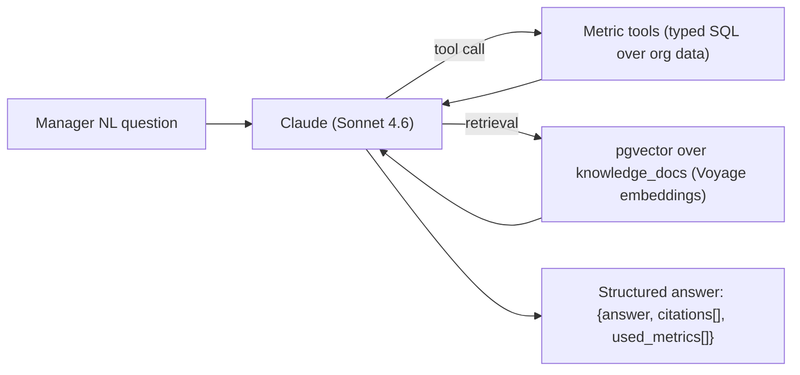

# Queue.ai — Flow Intelligence Spec (AI / ML)

**Version:** 1.0 (for approval)
**Phase:** 7
**Over:** [04 schema](04-DATABASE.md) (`predictions`, `activity_events`, `staff_throughput`, `daily_metrics`, `org_patterns`, `doc_chunks`), [06 architecture](06-ARCHITECTURE.md) §7.
**Six pillars:** Prediction · Optimization · Simulation · Recommendations · Automation · Analytics.

> **Governing rule:** every model is **heuristic-first** (works on day one, cold-start safe — CTO-4) and **graduates to ML** once the event log has enough data. The heuristic always remains as fallback/baseline. Every prediction is **measured against actuals** and the error feeds back into confidence (the Trust Engine stays honest, not just confident).
>
> **Resolved open questions:** embeddings via a dedicated embedding model (**Voyage `voyage-3`-class, 1024-dim** — Claude generates, it does not embed); ETA + confidence formulas specified below; **no PHI/PII is ever sent to Claude** — Flow Intelligence operates on aggregated, de-identified metrics + org knowledge docs only (NDPR; full treatment Phase 8).

---

## 1. Pillar 1 — ETA & Wait Prediction (Trust Engine F11)

### 1.1 Stage wait (heuristic v1)
For a ticket in a department's ACTIVE queue:
```
active_servers   = # staff in dept with status=online serving this stage's service
avg_service_s    = staff_throughput.avg_service_seconds   (fallback: services.avg_duration_seconds seed)
ahead_count      = # ACTIVE tickets ahead, counting only equal-or-higher acuity (R2)
stage_wait_s     = (ahead_count × avg_service_s) / max(active_servers, 1)
+ remaining_current_service (if a server is mid-service)
```

### 1.2 Visit ETA (the pipeline sum, R1)
```
visit_eta_s = remaining_wait(current_stage)
            + Σ over pending stages p of:  expected_queue_wait(p) + est_duration(p)
```
Pending-stage queue wait uses each department's *current* effective rate (v1); ML v2 forecasts the load at the patient's *projected arrival time* at that stage.

### 1.3 "Leave by" (Maps-style, for PRE_QUEUE)
```
leave_by = predicted_service_time − travel_time(Google Maps, live traffic) − arrival_buffer
```
Recomputed on traffic/queue/staff change → push only on threshold crossing (R6).

### 1.4 Confidence (0–1) — the honest part
```
confidence = clamp(
   w_stab·stability + w_avail·availability + w_hist·historical_accuracy − w_hz·horizon_penalty,
   0.40, 0.97)
```
| Factor | Definition |
|--------|-----------|
| `stability` | 1 − normalized variance of recent service times in this dept (steady → high) |
| `availability` | fraction of *expected* staff currently online (absences/breaks drop it — OPS-3) |
| `historical_accuracy` | 1 − rolling MAE of this dept's recent predictions vs actuals |
| `horizon_penalty` | grows with #pending stages & total ETA (distant = less certain) |

**Band width** scales inversely with confidence:
```
half_width = base_frac × (1 − confidence) × eta      → display "ETA_low–ETA_high"
```
Low confidence → wider band shown *calmly* (never a fake point time, R4).

### 1.5 Reasons (rule-based v1 → learned later)
Top contributing factors become human strings:
- availability high → "all doctors available"; a staffer just went away → "doctor temporarily unavailable" (OPS-3)
- stability high → "queue stable"; recent emergency insert → "emergency patient admitted" (R2)
- historical_accuracy high → "historical accuracy high"; cold start → "still learning this branch"

Output shape (matches `predictions` + API): `{value_low_s, value_high_s, confidence, reasons[]}`.

---

## 2. Pillar — No-show Prediction (OPS-1)
**v1 heuristic score → v2 logistic regression / GBM.** Features (all already in schema):
`lead_time` (book→appointment), `channel`, `prior_no_show_count` (customer_org_link), `day_of_week`, `time_of_day`, `activated?` (did they tap "on my way"), `distance`/geofence signals, `acuity`.
- v1: weighted rule score → risk band (low/med/high).
- Drives **overbooking** (R9): overbook appointment slots ∝ predicted aggregate no-show risk.
- v2 trained once ≥ a few hundred labeled outcomes per branch exist.

---

## 3. Pillar — Demand / Busy-Day Forecast
Per branch × department × hour arrival forecast.
- **v1:** historical hourly averages × **Org Memory factors** (§7).
- **v2:** time-series model (e.g. gradient-boosted on calendar+weather features, or Prophet-style) over `activity_events`.
- Feeds Predictive Operations and Capacity AI.

---

## 4. Pillar — Capacity AI (F2, the willingness-to-pay feature)
**Input:** current load + per-server rates (`staff_throughput`) + demand forecast.
**Compute:** for each department, projected wait = forecast arrivals vs effective service rate; find where wait crosses SLA. Then **greedy reallocation search** (v1): which single move (move 1 tech, open Room 6, delay appts 20m) most reduces the max projected wait?
**Output:** ranked recommendations with projected impact (`"open Counter 6 → avg wait −22%"`).
- v1 = rule/greedy optimization (explainable, cheap). v2 = constrained optimization / RL once data supports it.
- **Earned, not free:** gated behind a data-volume threshold; labels confidence; always human-in-the-loop (recommend, don't silently act).

---

## 5. Pillar — Predictive Operations (F13, the unique edge)
Run current state **forward** over a short horizon (next 60–90 min):
```
for each department, each 5-min bucket ahead:
   projected_queue = current_queue + forecast_arrivals − projected_service
   if projected_wait crosses SLA at time T:  emit warning(dept, T, Capacity-AI recommendation)
```
→ `predictions(kind=dept_load)` + WS `prediction.warning` → "⚠ Lab overloaded in ~47 min · move 1 tech [Apply]".
This is Capacity AI applied to the *future*, not the present. The whole point: **prevent the bottleneck, don't report it.**

---

## 6. Pillar — Simulation (F5)
**Mechanism:** replay `activity_events` under a counterfactual parameter set (close Counter 4, +1 doctor, +20% arrivals) through the same queue/ETA engine → recompute waits → report deltas vs actual/baseline.
- "Close Counter 4 → waiting +18%, avg delay +22 min."
- **Validation:** replay real history with *true* parameters and confirm the engine reproduces the actual outcomes (sim is trustworthy only if it back-tests). 
- Same engine powers `flows/{id}/simulate` (preview a flow) and `branches/{id}/simulate` (what-if ops).

---

## 7. Pillar — Organization Memory (F14)
Learns multiplicative factors per recurring key, stored in `org_patterns`:
```
arrival_factor[dow=mon]   = rolling_mean(actual_arrivals / baseline_arrivals on Mondays)
demand_factor[weather=rain] = rolling_mean(... on rainy days)     # weather via external API
service_factor[holiday]   = ...
```
- Bayesian/rolling update as new days complete; `confidence` per pattern grows with observations.
- Factors multiply the demand forecast and ETA inputs → predictions adapt to *this* org's rhythms ("every Monday the cardiologist arrives late → mornings run slower").
- Pure data feature; needs accumulated history → activates after baseline period.

---

## 8. Flow Score (F12) & AI Health Score (F8)
Single 0–100 composite, daily, in `daily_metrics`:
```
flow_score = 100 × ( w1·wait_perf + w2·(1−no_show_rate) + w3·utilization
                   + w4·csat_norm + w5·sla_adherence )
wait_perf  = clamp(baseline_wait / actual_wait, 0, 1)     # vs captured baseline (R8)
```
- `delta` vs prior day; `best/worst_department` = highest/lowest sub-score dept.
- `ai_summary` (grounded, §9): "Reception excellent; Lab is the constraint — open a 2nd counter 10–12 (≈ −22% wait)."
- Ties to **Law #0**: `time_saved_seconds` reported alongside (sum of baseline_wait − actual_wait across visits).

---

## 9. Grounded Assistant (R7) — Claude architecture



- **Model:** `claude-sonnet-4-6` (default), `claude-opus-4-8` for the hardest "why" analysis, `claude-haiku-4-5` for cheap classification (WhatsApp intent, no-show labeling).
- **Tools (typed, read-only):** `get_wait_stats`, `get_dept_load`, `get_flow_score`, `get_no_show_stats`, `get_throughput`, `get_baseline` — Claude composes answers from *tool results*, never from imagination.
- **Structured outputs** for any cited figure; **citations** link each claim to a metric/source (R7). Refuses gracefully if data is insufficient.
- **Grounding guarantee:** the assistant cannot state a number it didn't retrieve.
- **Cost/latency guards (from 06):** prompt caching on the stable system + tool-schema prefix; per-org AI budget; daily reports cached/batched; tiered models.
- **Privacy:** tools return **aggregated, de-identified** metrics — no patient names/PII enter the prompt (NDPR; Phase 8 details the data-flow & DPA).

---

## 10. Heuristic → ML graduation

| Capability | v1 (day one) | Graduates to ML when | v2 |
|------------|-------------|----------------------|----|
| Stage/visit ETA | formula §1 | ≥ ~few hundred completed stages/dept | regression on throughput+features |
| Confidence | weighted factors §1.4 | accuracy history accrues | calibrated (isotonic/Platt) on pred-vs-actual |
| No-show | rule score | ≥ labeled outcomes | logistic / GBM |
| Demand | hist avg × Org Memory | seasonal history | time-series / GBM |
| Capacity AI | greedy search | utilization history | constrained optimization |
| Reasons | rules | — | learned salience |

ML runs in the separate **Python service** (06 §7), trained offline on the event log, served behind the same Flow Intelligence API; **heuristic stays as fallback** if a model is unavailable or low-confidence.

---

## 11. Accuracy & the honesty feedback loop (critical)
- Every `prediction` is later compared to the actual outcome → store error.
- Metrics: **% of ETAs the actual falls within the stated band (PRD target ≥80%)**, MAE, calibration curve (does "90% confidence" actually mean 90%?).
- These feed back into `historical_accuracy` (§1.4) and confidence calibration → the Trust Engine self-corrects. A model that's confidently wrong gets *less* confident automatically.
- Surfaced to us in observability (06 §10); never let displayed confidence drift from real accuracy.

---

## 12. What's MVP vs later (ties to feature register)
| MVP (heuristic) | Fast-follow / needs data |
|-----------------|--------------------------|
| ETA + confidence + reasons (F11) | Capacity AI (F2) |
| Flow Score + Health Score (F12/F8) | Predictive Operations (F13) |
| Grounded assistant + daily report (R7) | Simulation (F5) |
| Baseline / time-saved (R8/Law#0) | Organization Memory (F14) |
| No-show *heuristic* → overbooking (R9) | No-show ML, demand ML |

---

## 13. Open questions for Phase 8/9
1. Exact weights (`w_*`) — calibrate on pilot data (start with sensible priors).
2. Weather data source for Org Memory (provider + cost).
3. Embedding provider final pick (Voyage vs open-source self-host) + cost.
4. AI monthly budget per tier (feeds pricing, Phase 9).
5. Data-processing agreement / exact de-identified payload to Claude (Phase 8).

---

## Approval
> ✅ **Approve Phase 7** to proceed to **Phase 8 — Security & Compliance** (auth/RBAC depth, NDPR/HIPAA-aligned data handling, the Claude data-flow & DPA, audit, encryption, threat model).
> Or request changes to the models (different ETA/confidence formulation, model choices).
